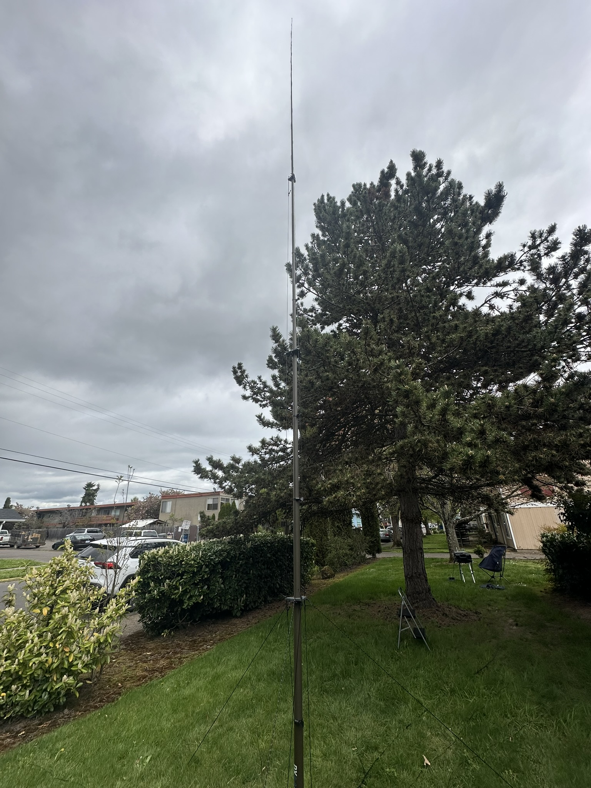
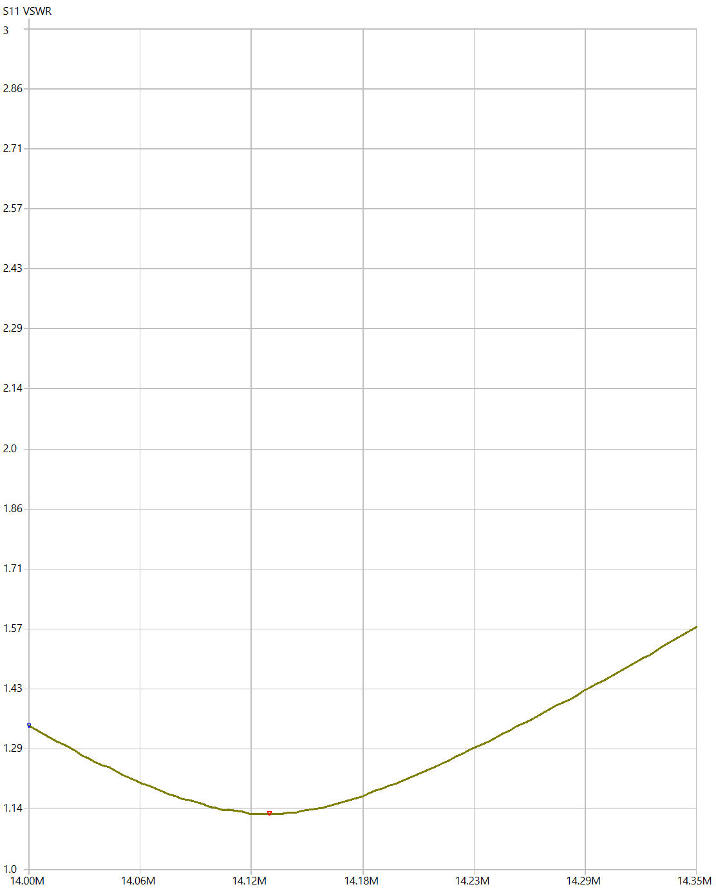
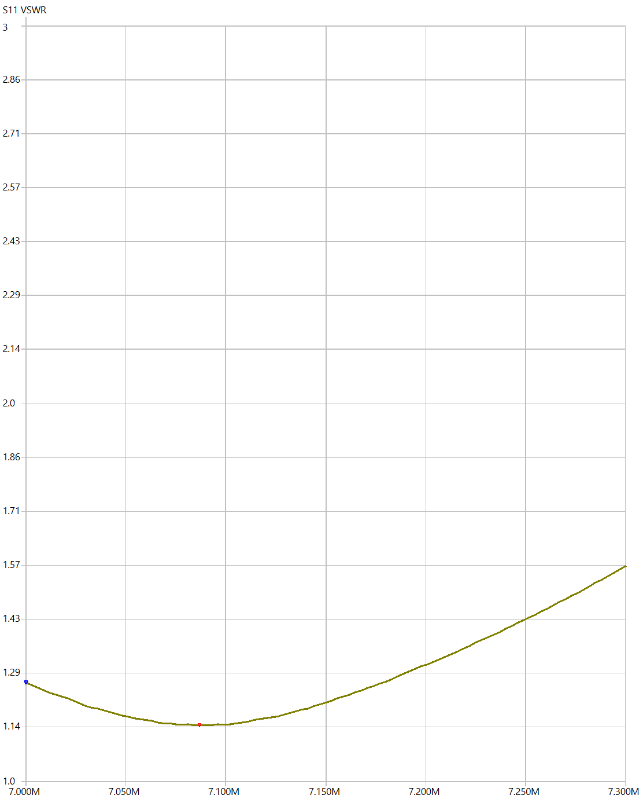
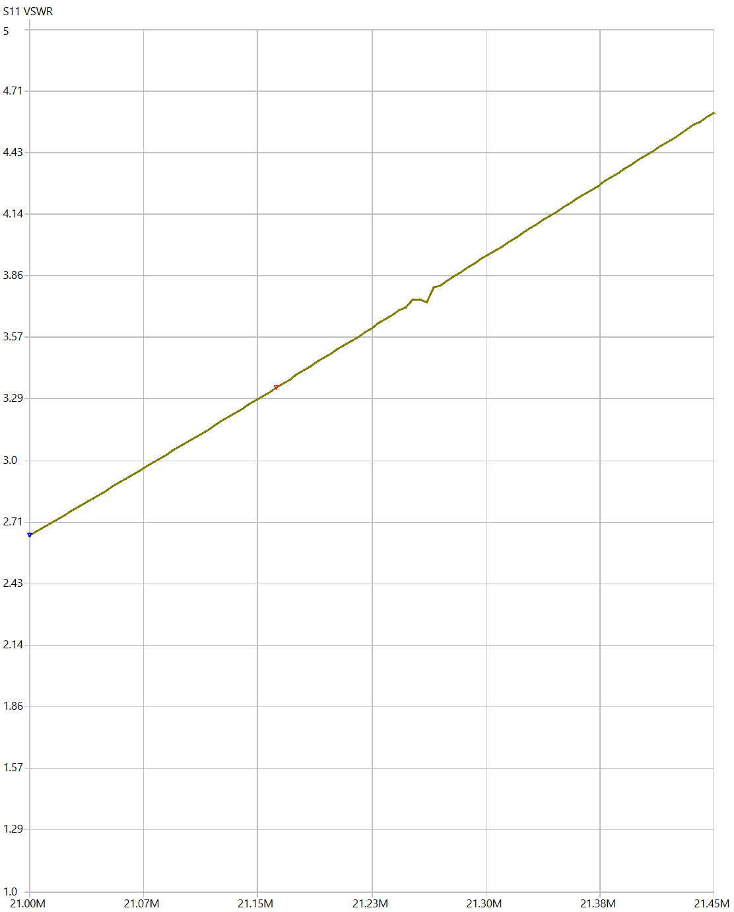

Recently I got a new [DXCommander Expedition Antenna](https://dxcommander.com/product/dx-commander-expedition-kit/) for Parks on the Air (POTA) use.
After some experimentations, this week I decided to finish the tuning, and make a few contacts with it

## Initial thoughts

It's a large antenna!
See in context with a large pine tree. 

It took a while to set up, with a couple of saw horses it's not too bad.
Having the antenna at a reasonble height avoids all be bending over to cut and measure things.
Once it was clear where everything went, and had the clamps trimmed to size, the assembly went smooth.

I also tried tryting to extend the antenna while it's vertical.
I don't recomment this approach.
It doesn't work and it will come crashing down and "colapse" quite fast.

The best option for deploying in the field is to lay it down, assemble everything, then walk it up.
It's light enough that it's easy to do with a single person.

## The good

The tuning! 40 and 20 meters are spot on, with barely any noticeable movement of the SWR meter while transmitting. 

20 meters is well below 2.0 SWR across the entire band.

For 40 meters, the story is the same. 

The 40 meters element ended up a lot longer than I expected.
So long, in fact, that I don't need any shockcord at the top.
It reaches the top of the pole, and I use the little clear platic tubing to hold the element in place.
A loop of shockcork keeps me from loosing the little plastic tube.

I opted for a "perfect" 40 meter tune, and this probably lead to the long element, and the not so great 15 meter performance (more on that later).

## The OK

Tuning the 10 meter band was a bit more finicky than I liked.
I was able to get it under 3.0 across the whole band, and I was able to use it fine without using the internal ATU of the radio.

(Sorry, no image of the 10 meter turning.
I closed the software and didn't save the image, and I only realized this after the antenna was down.
I'm not going to stand it back up, in the rain, for one image.
You'll have to trust me on this one)

## The meh

15 meters. 
It's tuning is not great, see below.

In practice, I get under 2.0 with the Icom 7300 (very brief testing).
It's usable without an ATU, and well within ATU limits if I'm using a radio that has one built in.

It's possible the "overtunning" the 40 meter band got me worse performance here.
But it's a compromise I made on purpose.
I use 40 meters a lot more often than 15, and I'm happy with the overall result.

Also, the elements are a bit loose than I'd like.
The tensioning loops ended up very close to the spreader plates.
This might be my error in assembly, but for future reference, having the loops a few inches down is OK, as there's pleny of shockcord to accomodate this.

## Conclusions

It's a great antenna!

It's larger than I expected.
But it did deliver the performance I was expecting.
It's now in the back of the truck, and I'm looking forward to trying out in the field on the next POTA activation!