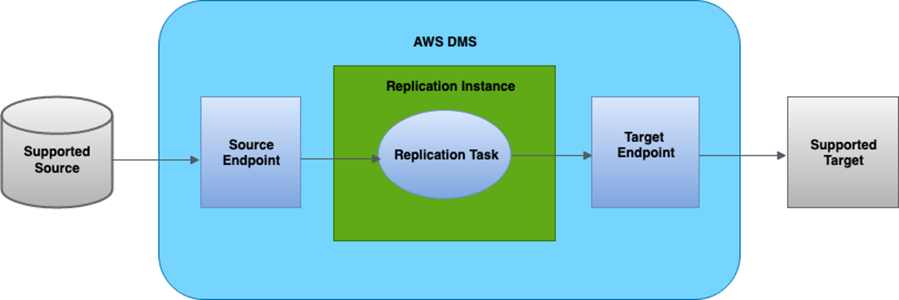
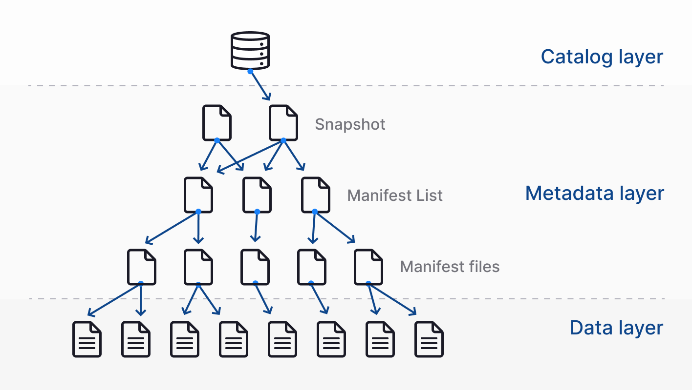
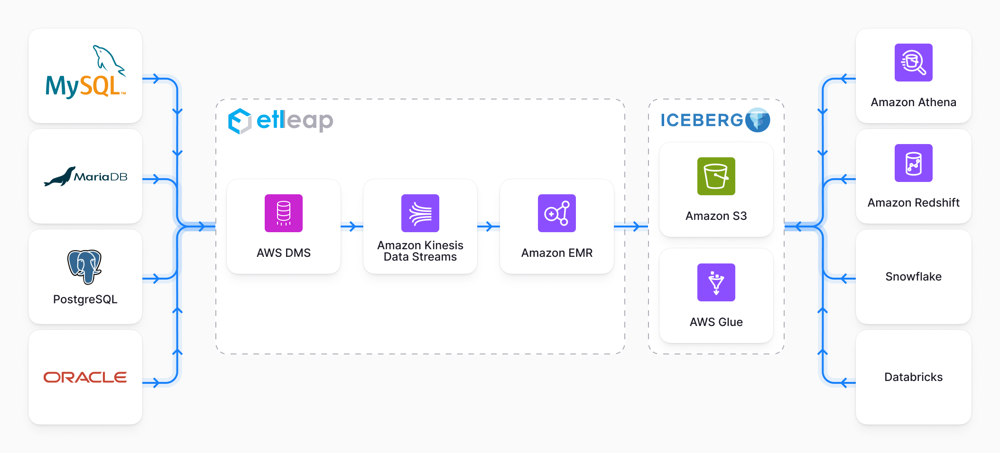
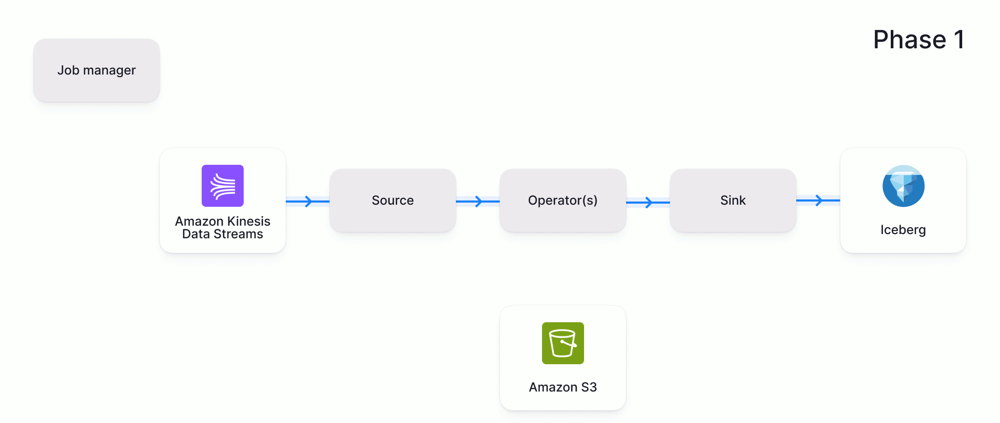
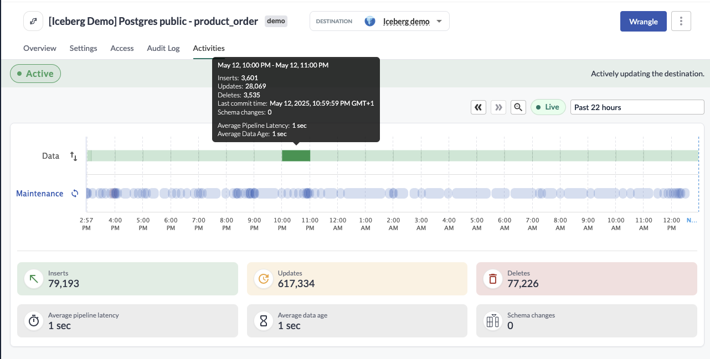

*This post was original posted on the AWS Big Data blog.
[You can access it here](https://aws.amazon.com/blogs/database/real-time-iceberg-ingestion-with-aws-dms/).*

*By Caius Brindescu, Principal Engineer at Etleap and [Mahesh Kansara](https://www.linkedin.com/in/mahesh-kansara/), Database Engineering Manager at AWS*

Timely decision-making depends on low-latency access to the freshest data. 
But for many teams, reducing latency into a data lake means wrestling with update handling, pipeline complexity, and warehouse integration. 
[Apache Iceberg](https://iceberg.apache.org/) changes that equation by making real-time ingestion and multi-engine access practical and efficient.

[Etleap](https://etleap.com/) is an [AWS Advanced Technology Partner](https://partners.amazonaws.com/partners/001E000000e1mVDIAY/Etleap) with the AWS Data & Analytics Competency and [Amazon Redshift](https://aws.amazon.com/redshift/) Service Ready designation. 
In this post, we show how Etleap helps you build scalable, near real-time pipelines that stream data from operational SQL databases into Iceberg tables using [AWS Database Migration Service](https://aws.amazon.com/dms/) (AWS DMS). 
You can use AWS DMS as a robust and configurable solution for change data capture (CDC) from [all major databases](https://docs.aws.amazon.com/dms/latest/userguide/CHAP_Source.html) into AWS.

Drawing from real-world use cases, we show how we provide consistency, fault tolerance, integration with cloud data warehouses—so your data can drive action when it matters most.

## Introduction to AWS DMS

AWS DMS is a cloud service that simplifies the migration of relational databases, data warehouses, NoSQL databases, and other types of data stores.
You can use AWS DMS to migrate your data into the AWS Cloud or between combinations of cloud and on-premises setups.

With AWS DMS, you can perform one-time migrations, and you can replicate ongoing changes to keep sources and targets in sync in near to real time depending on different factors.
There might be a small delay between when a change is made in the source and when it’s replicated to the target.
This delay, or latency, can be influenced by various factors, including AWS DMS settings, network bandwidth, and the load on both the source and target databases.

The following diagram illustrates the AWS DMS replication process.



## Introduction to Iceberg

Iceberg is an open table format designed for large-scale analytics on data lakes. 
It brings full support for ACID transactions, hidden partitioning, schema evolution, and time travel—without requiring expensive table rewrites or downtime.

Unlike older formats like Hive, Iceberg tracks metadata separately from data files, enabling fast snapshot reads and efficient file-level updates.
Data files are immutable, and changes are applied by creating new snapshots, making operations like upserts and deletes safe and performant.
The following diagram illustrates the file layout for an Iceberg table.



Iceberg is an engine-agnostic data storage format and integrates with Spark, Apache Flink, Trino (including services like [Amazon Athena](http://aws.amazon.com/athena)), and Hive.
It’s a strong foundation for building production-grade, low-latency data lake architectures that can serve multiple downstream systems reliably.
By querying the catalog, each engine will have a consistent view of the data being stored.

## Why Etleap customers need Iceberg

For Etleap customers, low latency is a top priority.
We define latency as the time lag between the source and destination data.
For example, if the destination is 5 minutes behind the source, then latency is 5 minutes.

Traditional data warehouses and data lakes impose limits on how low you can drive latency.
In warehouses, each load lands new data in a staging area and then runs a merge that scans much of the target table before rewriting it.
Touching the data twice- once to read, once to rewrite – is what adds the bulk of the delay.

Data lakes, on the other hand, are typically append-only and don’t handle updates efficiently.
You can either store all row versions and resolve the latest at query time—sacrificing query performance—or precompute the latest state at load time, which requires expensive table rewrites and adds latency.

Iceberg solves both of these challenges for Etleap users.
In one case, a European bike-sharing company uses an operational dashboard to monitor bike rack availability and comply with regulations that limit how long a rack can remain empty.
By reducing pipeline latency from 5–10 minutes to just a few seconds, Iceberg enables more real-time data, giving operators critical extra time to rebalance racks and avoid penalties.

In another case, a team needed to make a single dataset available across multiple data warehouses.
Previously, this meant building and maintaining separate pipelines for each destination.
With Iceberg, they can load data one time and support querying from multiple engines, reducing complexity and providing consistency across tools.

## Solution overview

The first step is extracting updates from source databases as quickly as possible.
For this, we use AWS DMS, which reliably scales to high-throughput data capture (CDC).
AWS DMS writes changes to [Amazon Kinesis Data Streams](https://aws.amazon.com/kinesis/data-streams).
Etleap reads the data stream and processes the changes using Flink on [Amazon EMR](https://aws.amazon.com/emr/).
From there, data is written to Iceberg tables stored in Amazon S3, and [AWS Glue](https://aws.amazon.com/glue) is used as the data catalog.
This allows for the data to be queried from multiple query engines.
The following diagram illustrates the pipeline architecture.



## Exactly-once processing

To maintain data integrity in low-latency pipelines, it’s not enough to move data quickly—it must also be processed exactly once.
Duplicate or missing records can lead to incorrect results, especially in update-heavy workloads.
After changes are captured by AWS DMS and streamed into Kinesis Data Streams, Etleap provides exactly-once processing using Flink’s two-phase commit protocol.

In phase one, Flink injects a checkpoint barrier into each parallel stream of data (see the following figure).
As the barrier flows through the pipeline, each operator pauses, synchronously saves its state, and then forwards the barrier downstream.
After that, it asynchronously persists the state snapshot to durable storage—in our case, Amazon S3.
This separation makes sure critical processing isn’t blocked while waiting on I/O.
After the operators have successfully saved their state, they notify the Flink Job Manager that they’ve completed the checkpoint.



In phase two, the Job Manager confirms that all parts of the pipeline have completed the checkpoint, then broadcasts a global commit signal (see the following diagram).
At this point, operators can safely perform side effects, such as writing data to external systems.
In Etleap’s case, this includes committing a new snapshot to the Iceberg table and recording metrics for monitoring.


To support fault tolerance, commit operations are implemented to be idempotent.
This applies both to writing a new snapshot to the Iceberg table and recording pipeline metrics and logs.
If the pipeline fails during this stage and needs to restart, Flink will safely reattempt the commit.
Because each operation can run multiple times without producing duplicates or inconsistencies, we maintain data correctness even in the face of failure.

The final piece of the puzzle is checkpoint frequency—how often the pipeline commits data to Iceberg.
This setting plays a critical role in determining overall pipeline latency.
After evaluating our use cases, we’ve chosen a checkpoint interval of 3 seconds.
This strikes an effective balance: it keeps end-to-end latency under 5 seconds while minimizing the performance overhead introduced by frequent commits.
This interval also aligns well with the warehouse metadata refresh cycle, as discussed in the following section.

## Table maintenance and warehouse integration

Over time, Iceberg tables accumulate metadata, snapshots, and suboptimal file layouts that can degrade performance.
To keep query performance high and storage efficient, regular maintenance is essential.
This includes tasks like data file compaction, snapshot expiration, and metadata cleanup.
Etleap handles these maintenance tasks automatically, without interrupting ingestion.
Maintenance jobs run in parallel with data pipelines and are triggered based on heuristics like file size distribution and snapshot count.

The following screenshot shows an example of the Etleap pipeline showing parallel maintenance activities being run, without interrupting the flow of data.



The final piece is warehouse integration. One of Iceberg’s key advantages is interoperability: the same table can be queried from engines like Athena, [Amazon Redshift](http://aws.amazon.com/redshift), Snowflake, and Databricks.

Although manual setup is possible, Etleap can configure these integrations automatically when a pipeline is created. 
For example, to make an Iceberg table queryable in Snowflake, we create a catalog integration with AWS Glue and define an external volume pointing to the table’s Amazon S3 location:

```sql
CREATE CATALOG INTEGRATION ETLEAP_ICEBERG_CATALOG
CATALOG_SOURCE = GLUE
GLUE_AWS_ROLE_ARN = 'arn:aws:iam::123456789012:role/etleap-streaming-ingestion-snowflake'
GLUE_CATALOG_ID = '123456789012'
CATALOG_NAMESPACE = 'iceberg_lake'
GLUE_REGION = 'us-east-1'
TABLE_FORMAT = ICEBERG
ENABLED = TRUE;
CREATE EXTERNAL VOLUME ETLEAP_ICEBERG_EXTERNAL_VOLUME
STORAGE_LOCATIONS = ((
	NAME = 'etleap_iceberg_bucket'
	STORAGE_PROVIDER = 'S3'
	STORAGE_AWS_ROLE_ARN = 'arn:aws:iam::123456789012:role/etleap-streaming-ingestion-snowflake'
	STORAGE_BASE_URL = 's3://etleap-data-lake/iceberg'
))
ALLOW_WRITES = FALSE;
```

Then we can then create a new table in Snowflake that points to the Iceberg table:

```sql
CREATE OR REPLACE ICEBERG TABLE "product_order"
EXTERNAL_VOLUME = ETLEAP_ICEBERG_EXTERNAL_VOLUME
CATALOG = ETLEAP_ICEBERG_CATALOG
CATALOG_NAMESPACE = 'iceberg_lake'
CATALOG_TABLE_NAME = 'product_order';
```

To keep Snowflake in sync with the latest Iceberg snapshots, Etleap triggers a REFRESH operation after each commit.
This makes sure users see the freshest data and prevents the view in Snowflake from drifting too far behind.
The synchronous nature of the refresh also provides a natural rate-limiting mechanism, aligning snapshot visibility with warehouse query performance.

## Conclusion

Building low-latency, reliable data pipelines into Iceberg is achievable using AWS tools like AWS DMS, Kinesis Data Streams, and Amazon EMR, combined with Iceberg’s support for updates, schema evolution, and multi-engine access. 
In this post, we showed how to stream changes from operational databases into Iceberg with end-to-end latencies under 5 seconds—while preserving data integrity and supporting downstream analytics in tools like Snowflake.
This architecture offers a powerful foundation for teams looking to modernize their data lakes, unify access across engines, and meet real-time operational requirements.

To see how Etleap makes this possible out of the box, including automatic pipeline creation, fault-tolerant processing, and Iceberg maintenance, [sign up](https://etleap.com/demo) for a personalized demo.
